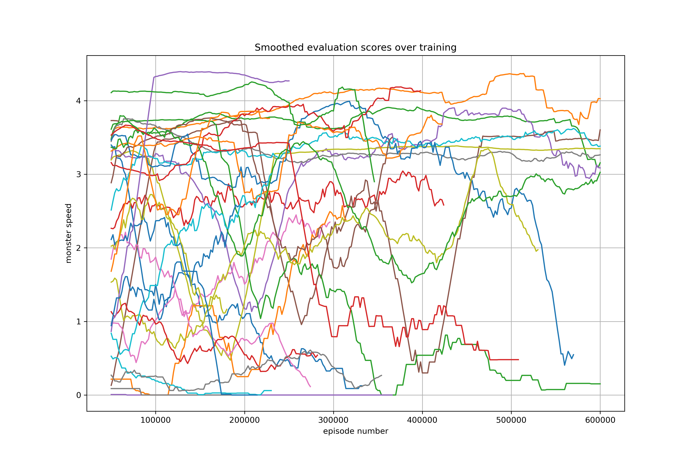

# lake-monster

> Use reinforcement learning to solve the lake monster problem.

- [Introduction](#introduction)
- [Installation and Usage](#installation-and-usage)
- [Environment and Agent](#environment-and-agent)
- [Learning](#learning)
- [Results](#results)
- [Variations](#variations)
- [License](#license)

## Introduction

You find yourself in the middle of a circular lake in a rowboat. Glancing toward the shore, you spot a monster watching your every move. Startled, you start to row away from the monster. It runs along the circumference, tracking you, always heading toward the point on the shore closest to you. If you can get to the shore without intersecting the monster, you'll be able to outrun it, avoiding death. However, stuck in your rowboat, the monster is clearly faster than you. If you row in an optimal path to the shore, is it possible to escape? More precisely, what is the maximum speed at which the monster can move while still providing you with the opportunity to escape?

|                                 |
| :-----------------------------------------------------------: |
| _An agent who cannot quite escape and eventually gets eaten._ |

This [lake-monster problem](http://datagenetics.com/blog/october12013/index.html) is a classic mathematical riddle involving basic geometry and calculus. It is difficult to determine the optimal path to the shore and the maximal monster speed under which escape is possible. The [shape of the optimal path](https://puzzling.stackexchange.com/a/2161) is complex, involving both spiral and linear motion. In short, although the solution to this problem is well understood mathematically, it is difficult to discover without mathematical insight. It is unlikely that a human player would be able to stumble across a near-optimal solution through unguided trial and error. For these reasons, the lake-monster problem provides a novel and fertile testing ground for reinforcement learning algorithms.

Reinforcement learning (RL) is a machine learning framework in which an _agent_ interacts with an _environment_ in hopes of maximizing some long-term _reward_. In RL, the agent observes its environment at discrete time steps. Using its decision making _policy_, the agent chooses an _action_ to take within the environment. The environment updates in response to the agent's action, resulting in a new observation at the following time step. This observation-action cycle continues until some terminal environment state is encountered. One full trajectory from an initial state to a terminal state is known as an _episode_.

The lake-monster problem is readily adaptable to the RL framework. Specifically, the _environment_ consists of the lake, the rowboat, and the land-locked monster. The _agent_ is guiding the rowboat hoping to escape. The _policy_ is the agent's decision making process. The _action_ is the direction in which the agent chooses to propel the rowboat. After an action is taken, the environment is updated as the monster runs across an arc of the lake's circumference in hopes of getting closer to the tasty agent. The _episode_ is the sequence of agent actions resulting in the agent's escape or capture. The RL approach used in this project is the Deep Q-Network (DQN) algorithm.

## Installation and Usage

### Installation

This simulation was created with Python 3.8 using TensorFlow and TF-Agents.

You can clone or download this repository locally. You may want to create a new Python environment to install the dependencies using an environment manager such as `conda`.

```sh
conda create --name monster python=3.8
conda activate monster
pip install -r requirements.txt
```

### Tests

Test the lake-monster environment by running `python test_environment.py`. This script initializes a random policy to interact with `LakeMonsterEnvironment` (see [Environment](#environment-and-agent)) and creates a sample video showing an episode. Test the TensorFlow-derived DQN-based agent framework by running `python test_agent.py`. This script instantiates several `Agent` objects, prints out network statistics, and runs a few episodes using the TF-Agents `DynamicEpisodeDriver` pipeline.

|                                |
| :---------------------------------------------------------------: |
| _An agent with a random policy interacting with the environment._ |

### Usage

After testing the environment and agent classes, you can train your very own agent to try to solve the lake-monster problem by running `python train.py`. Default parameters are strong, and can be modified in the source code. Additional options can be viewed by running `python train.py --help`.

```sh
Usage: python train.py [arg]
Train an RL agent to solve the lake monster problem.
    The optional argument [arg] could be one of:
    --default       Train a new agent with default parameters.
    --random        Train a new agent with random parameters.
    --many          Train a new agent with random parameters every 24 hours.
    --multi         Train a MultiMonsterAgent with preset parameters.
    --jump          Train a JumpingAgent with default LakeMonster parameters.
    --clear         Remove videos and checkpoints saved during last trained agent.
    --clearall      Clear all saved policies, results, logs, videos, and checkpoints.
    --help          Print this help message.
```

See [Learning](#learning) for a discussion of parameter selection. As the agent learns, several pieces of training knowledge are saved.

- TensorFlow checkpoints are saved in the `checkpoints/` directory. These checkpoints store the current state of the agent and its associated TF-Agents objects (for example, the _replay buffer_). Training can be keyboard interrupted at any point in time and continued from the last saved checkpoint by re-running `python train.py`.
- Training statistics are logged through `tf.summary` methods and saved in the `logs/` directory. Statistics are indexed by the episode number and include metrics such as reward, training loss, number of environment steps taken by the agent, and network weights. These statistics can be viewed through TensorBoard (see images below), which automatically loads in a browser tab.
- Video renders of the agent interacting with the environment are periodically captured and stored within the `videos/` directory.
- Agent policies are periodically time-stamped and saved in the `policies/` directory. Saved policies are slimmed-down checkpoints containing only hyperparameter values and network weights. They can be used to evaluate agents and render episodes after training is complete.
- Results across distinct agents are saved in `results.json`.

|                                  |                          |
| :------------------------------------------------------: | :----------------------------------------------------: |
| _A loss statistic tracked over training in TensorBoard._ | _Offset histograms of the weights of a network layer._ |

## Environment and Agent

The [environment](environment.py) module contains the `LakeMonsterEnvironment` class which defines the RL environment of the lake-monster problem. `LakeMonsterEnvironment` inherits from `PyEnvironment`, an abstract base class within the TF-Agents package used for building custom environments.

The [agent](agent.py) module contains the `Agent` class. This defines the DQN agent which explores within the environment. An `Agent` object contains instances of TF-Agents objects used throughout the training process. Member variables include training and evaluation environments (wrapped into TensorFlow objects), a replay buffer for enabling DQN learning, and several other objects needed within the TF-Agents training pipeline.

We represent the lake as a unit circle, the monster as a point on the circumference of that unit circle, and the agent as a point in the interior of the circle. Even though the lake-monster problem deals with continuous motion, it can be discretized in order to simulate it in a DQN setting. Discretizing the lake-monster environment gives additional advantages to the monster since the agent is constrained in its movement.

At each time step, the agent has only finitely many actions to choose among (see [Action](#action)). Additionally, we impose a maximum number of steps that the agent is allowed to take. Once the agent exceeds this threshold, the current episode terminates. Consequently, there are finitely many trajectories (albeit an astronomically huge number) that the agent could take within the environment.

### State

The state of the environment can be encapsulated with a single vector that describes the position of the monster, the position of the agent, and the number of steps taken within the current episode. Other parameters, such as the speed of the monster and the step size are also included in the state.

To take advantage of the symmetries of the circle, the entire lake (agent and monster included) is rotated after each time step so that the agent is mapped to the positive x-axis. This transformation reduces the complexity of the problem for the agent.

### Action

Currently, the TF-Agents implementation of a DQN agent requires the action of the agent to be both 1-dimensional and discrete. The parameter `n_actions` specifies the number of possible directions that the agent can step. Each integer action is mapped to a unique angle on the circle. Additionally, `n_actions` is the dimension of the output of the policy network. Choosing a small value for `n_actions` (such as 4) enables faster learning at the expense of less mobility for the agent.

|                         |
| :------------------------------------------------------------: |
| _An agent with `n_actions = 8` moving around the environment._ |

### Reward

The agent receives a reward of +1 if it successfully escapes from the lake without being captured by the monster and receives no reward if it is captured. If the agent takes more steps than allowed within an episode, the agent receives a small negative reward. The purpose of discouraging timeouts is to incentivize the agent to attempt an escape rather than to wander aimlessly.

In default training instances, the agent is provided with mini-rewards. Rather than give the agent a binary reward of 0 or 1, we give partial rewards for a near escape. If the agent is captured by the monster, there must be at least one step at which the monster is situated on the shore waiting for the agent to arrive. The longer an agent can avoid a waiting monster, the closer it is to escaping. For this reason, agents can be given with additional rewards when they make it close to the shore without encountering a waiting monster. Similarly, agents can be given bonus rewards for succeeding by a wider margin.

The lake-monster problem is an example of a _sparse reward_ or _delayed reward_ environment. Agents only receive rewards at the termination of an episode; there is no reward at a transitional step within an episode. Some episodes may take dozens or even hundreds of steps to finish; consequently, learning in such an environment is difficult. Although it is possible to craft transitional rewards that steer an agent toward an optimal path, doing so defeats the goal of autonomous human-independent agent learning. We avoid human crafted step-by-step rewards.

|                                                                                                                                                                        |
| :-----------------------------------------------------------------------------------------------------------------------------------------------------------------------------------------------------: |
| _An agent receiving a partial reward for getting closer to the shore. The velocity vector in the upper left hand corner of the animation changes color once the monster becomes inline with the agent._ |

## Learning

### Parameters

There are a number of parameters and hyperparameters involved in both the environment specification as well as the DQN agent. When initializing an `Agent` object, the following variables can be specified.

- `n_actions` -- set the number of possible directions the agent can step
- `initial_step_size` -- set the length of each step made by the agent
- `initial_monster_speed` -- set the speed of the monster at the start of training
- `timeout_factor` -- an episode terminates once the number of steps exceeds `timeout_factor / step_size`
- `use_mini_rewards` -- see [Reward](#reward)
- `fc_layer_params` -- specify parameters for the fully connected neural network underpinning the policy
- `dropout_layer_params` -- create dropout layers in the neural network
- `learning_rate` -- set the learning rate for the neural network Adam optimizer
- `epsilon_greedy` -- control the amount of exploration in DQN training
- `n_step_update` -- the number of steps to look ahead when computing loss of Q-values
- `use_categorical` -- see this TensorFlow [tutorial](https://www.tensorflow.org/agents/tutorials/9_c51_tutorial)
- `use_step_schedule` and `use_mastery` -- see [Modifying Parameters](#modifying-parameters)

As `n_actions` and `timeout_factor` grow large and `step_size` approaches 0, the discrete lake-monster environment approaches the idealized lake-monster continuous-motion environment. There is a natural trade-off as the discrete environment tends towards a continuous-motion environment. As `n_actions` grows, the output dimension of the neural network grows, thereby increasing the overall complexity of the network. Additionally, DQN exploration grows linearly in `n_actions`. As a result, the policy takes longer to train. As `step_size` becomes small, the agent makes slower progress in reaching the shoreline. Each episode takes longer to run, and the entire training process crawls. As `timeout_factor` increases, an agent may spend additional time wandering without progress, thereby reducing learning. Conversely, as the environment tends toward one of continuous-motion, the agent is afforded more freedom in its movement which can allow it to perform better after extensive training.

The lake-monster problem provides a forgiving environment for the agent. If the agent makes poor decisions, it has the ability to correct them by taking actions to bring the environment back to its initial state. In the optimal solution, an agent would never arrive at a position radially inline with the monster. In the gif below, this occurs when the velocity vector changes color. The agent retreats from this sub-optimal state before continuing on to eventually succeed.

|                     |
| :-------------------------------------------------: |
| _A well-trained agent correcting initial missteps._ |

### Modifying Parameters

Some of the parameters defined above cannot be tweaked during training without instantiating a new agent. In general, parameters used to initialize the structure of the policy network or replay buffer cannot be changed. These include `n_actions`, `n_step_update`, `use_categorical`, and any of the layer-specific parameters.

Parameters such as `monster_speed`, `step_size`, and `learning_rate` can be adjusted throughout training. When training an agent, we often use a _mastery-based_ approach. In such an approach, an agent initially faces a slow monster. Once the agent has shown mastery in this easier environment, the speed of the monster is increased. In this way, the agent is always paired with a monster whose speed perfectly matches the agent's ability.

Extending this idea, the parameters `use_step_schedule` and `use_mastery` modify the variables`step_size` and `monster_speed` over the course of training. Utilizing a mastery-based approach generally leads to better learning outcomes. All of the agents from the [Results](#results) section use this mastery-based regimen.

Agent policies are periodically cached (see [Usage](#usage)) for later use. A saved policy can be revived and tested with modified parameters. Agents receiving extensive training can often succeed against faster monsters than those encountered in training. Specifically, agents have more opportunity to make precise movements when they able to take small steps. A well-trained agent can leverage this precision in their advantage.

### Nontrival Learning

Suppose that the agent runs antipodally away from the monster. The monster traverses the lake circumference, aiming for the point at which the agent will intersect with the shoreline. (The monster could make its semi-circumnavigation in a clockwise or counterclockwise motion; both paths lead to identical outcomes.) In such an episode, the agent travels a total distance of 1 whereas the monster travels a total distance of pi. Therefore, the agent succeeds with this strategy if and only if the speed of the monster is less than pi.

Because this strategy is so simple, it can be considered a baseline minimum for what the agent should aspire to achieve. In other words, the agent has learned something nontrivial if it can escape from a monster with a speed of at least pi. Due to the discrete nature of the environment (specifically, the discrete variables `step_size` and `n_actions`), the agent would not be able to enact this exact strategy in the continuous environment. Nevertheless, we still consider a monster speed of pi as a prerequisite for an intelligent agent.

With no knowledge of the mathematics, it is possible for a human to quickly learn to escape from a monster with speed pi. For example, the function `test_movement` in [`test_environment.py`](test_environment.py) uses simple handcrafted actions to succeed against a monster with speed 3.5. In the lake-monster problem, most humans could eventually fine-tune a set of actions to succeed against a monster with speeds between pi and 4.0. An agent can be described as having _human-level intelligence_ if it can succeed against monsters with speeds up to 4.0. An agent that can escape from a monster with speeds above 4.0 is considered to have _superintelligence_.

The [optimal mathematical solution](http://datagenetics.com/blog/october12013/index.html) allows an agent to escape a monster with a speed of 4.603..., and so no agent will actually perform better than a handcrafted agent created by a human expert (a mathematician).

|                |
| :-----------------------------------------------: |
| _An agent demonstrating complex learned actions._ |

## Results

### Evaluation

Periodically throughout training, agents are evaluated using the [evaluation](evaluation.py) module. Agent policies are placed in a series of different environments in which the `monster_speed` and `step_size` parameters are dynamically updated depending on the agent's performance. In this way, an agent can be probed to determine the maximum monster speed at which it can escape. The best result from these evaluations are logged in the `results.json` file.

_Below are several collections of agents in various states of training. Here, the monster is fixed in place and all agents are rotated toward the monster. Agents that stick to the shore have successfully escaped; those that wobble or wander will eventually be eaten. Many agents cling to the positive x-axis: the monster is fast enough to remain in line with them. Each gif shows the evolution of a single agent whose policies are timestamped over the learning process._


### Random parameters

Several dozen agents were trained for roughly half a million episodes by running `python train.py many`. Training sessions took 12 - 24 hours on a 2015 Macbook. Each agent was initialized with random parameters specified in the [utils](utils.py) module. Results of these training sessions are shown in the table below.

| max speed | avg speed | n act | init step | init speed | timeout | layers     | dropout    | learn rate | epsilon | update | categorical | schedule |
| --------: | --------: | ----: | --------: | ---------: | ------: | :--------- | :--------- | ---------: | ------: | -----: | :---------- | :------- |
|     4.521 |     3.937 |    16 |       0.2 |        3.7 |       2 | [100, 100] | None       |      0.002 |     0.1 |      8 | True        | True     |
|     4.488 |      3.64 |    32 |      0.05 |          4 |     1.5 | [50, 50]   | None       |     0.0005 |     0.1 |      4 | True        | False    |
|     4.452 |     2.958 |    32 |       0.1 |          4 |       2 | [10, 10]   | None       |     0.0005 |    0.03 |      8 | True        | True     |
|     4.416 |     2.985 |    16 |       0.2 |        3.7 |     2.5 | [20, 20]   | None       |      0.002 |     0.3 |      4 | True        | True     |
|     4.374 |     3.264 |    16 |       0.2 |          4 |       3 | [100, 100] | [0.3, 0.3] |      0.002 |     0.3 |      4 | False       | False    |
|     4.354 |     3.426 |    16 |       0.2 |        3.7 |       3 | [20, 20]   | None       |      0.002 |    0.03 |      4 | False       | False    |
|     4.348 |     3.621 |     8 |       0.2 |        3.7 |     2.5 | [100, 100] | [0.1, 0.1] |      0.002 |     0.1 |      4 | False       | True     |
|     4.345 |     3.892 |     8 |       0.1 |          3 |       2 | [50, 50]   | None       |      0.001 |     0.3 |      8 | True        | True     |
|     4.271 |     1.908 |    32 |      0.05 |        3.7 |       3 | [100, 100] | [0.5, 0.5] |      0.002 |     0.1 |      4 | False       | True     |
|     4.235 |     2.826 |     8 |       0.2 |        3.7 |       3 | [100, 100] | None       |      0.002 |     0.3 |     16 | True        | False    |
|     4.213 |     0.979 |    32 |      0.05 |          4 |     1.5 | [100, 100] | None       |      0.002 |     0.1 |      2 | True        | True     |
|     4.212 |     2.623 |    32 |      0.05 |          4 |       2 | [10, 10]   | [0.1, 0.1] |      0.001 |    0.03 |      2 | False       | False    |
|     4.195 |     3.275 |     8 |       0.2 |          3 |     2.5 | [100, 100] | None       |      0.002 |     0.3 |      1 | True        | False    |
|     4.172 |      2.18 |    32 |       0.1 |        3.7 |     2.5 | [10, 10]   | None       |      0.002 |     0.3 |      1 | False       | True     |
|     4.161 |     3.401 |    32 |       0.2 |          3 |     2.5 | [50, 50]   | [0.5, 0.5] |      0.001 |     0.3 |      2 | False       | False    |
|     4.051 |     1.909 |    16 |       0.1 |          4 |       2 | [100, 100] | [0.5, 0.5] |     0.0005 |    0.03 |      1 | False       | False    |
|     4.045 |      2.02 |    16 |      0.05 |        3.7 |       3 | [50, 50]   | None       |      0.001 |    0.03 |      2 | False       | False    |
|     4.029 |     1.206 |     8 |      0.05 |        3.4 |     2.5 | [10, 10]   | [0.3, 0.3] |     0.0005 |     0.1 |      1 | False       | False    |
|     4.026 |     1.581 |    32 |       0.1 |        3.7 |     1.5 | [100, 100] | None       |      0.002 |     0.1 |      1 | False       | True     |
|     4.019 |     3.019 |     4 |      0.05 |        3.7 |     2.5 | [100, 100] | None       |      0.002 |    0.03 |     16 | True        | False    |
|     4.006 |     0.601 |    32 |       0.2 |        3.4 |     1.5 | [100, 100] | [0.1, 0.1] |      0.001 |    0.03 |      2 | False       | False    |
|     3.999 |     0.853 |     4 |      0.05 |          3 |       2 | [50, 50]   | None       |      0.001 |    0.03 |      1 | True        | True     |
|      3.98 |     3.395 |     4 |       0.2 |        3.7 |       3 | [100, 100] | None       |      0.002 |    0.03 |     16 | True        | True     |
|     3.951 |     1.063 |     8 |      0.05 |          4 |     2.5 | [10, 10]   | None       |      0.001 |    0.03 |      2 | True        | False    |
|     3.939 |     2.079 |     4 |       0.2 |          3 |       3 | [100, 100] | None       |     0.0005 |    0.03 |      4 | False       | False    |
|     3.926 |     3.724 |     4 |       0.1 |          3 |     2.5 | [100, 100] | None       |      0.002 |     0.1 |      8 | True        | True     |
|     3.896 |     2.136 |     4 |       0.1 |        3.7 |     1.5 | [20, 20]   | None       |     0.0005 |    0.03 |      2 | False       | False    |
|     3.795 |     2.552 |    32 |      0.05 |          4 |       3 | [50, 50]   | [0.5, 0.5] |      0.001 |     0.3 |      8 | False       | True     |
|      3.57 |     3.187 |     4 |       0.2 |        3.4 |     1.5 | [50, 50]   | None       |      0.001 |     0.1 |      2 | True        | False    |
|     3.169 |     0.727 |    16 |       0.1 |        3.7 |     2.5 | [50, 50]   | None       |      0.002 |    0.03 |      1 | True        | True     |
|     2.187 |     0.022 |    32 |      0.05 |          4 |     2.5 | [100, 100] | None       |     0.0005 |     0.1 |      4 | True        | True     |
|     1.712 |     0.295 |     4 |       0.1 |        3.4 |       3 | [10, 10]   | [0.3, 0.3] |      0.002 |    0.03 |      4 | False       | False    |
|     1.659 |     0.175 |     4 |      0.05 |        3.7 |     2.5 | [10, 10]   | [0.3, 0.3] |      0.002 |    0.03 |      2 | False       | False    |
|     0.159 |     0.001 |     4 |      0.05 |        3.7 |     1.5 | [50, 50]   | [0.5, 0.5] |      0.001 |    0.03 |      2 | False       | False    |

The agent training process was extremely turbulent, with many agents failing to converge toward an optimal policy. Indeed, in most cases the agent evaluation score peaked at some point before episode 200,000. The maximum monster speed is the key metric of interest, and so long term instability of an agent is acceptable.

|                          |
| :----------------------------------------------------: |
| _Smoothed evaluation scores over the training period._ |

### Strongest results

Below are several gifs showing the strongest agent encountered through training. This agent is evaluated at various step sizes and monster speeds.

|                                   |
| :---------------------------------------------------------------: |
| _The strongest discovered agent evaluated at a medium step size._ |

|                            |
| :-------------------------------------------------------: |
| _The same agent as above evaluated at a small step size._ |

|                            |
| :------------------------------------------------------------: |
| _The same agent as above evaluated at a very small step size._ |

## Variations

We consider two slight variations of the lake monster problem.

### Jumping

In the `JumpingEnvironment` class, the monster randomly teleports to a new location at some randomly chosen step within the episode. In such an environment, it is possible for the agent to (occasionally) succeed against a monster with arbitrarily high speed. If the monster jumps exactly when the agent is close to the lake shore, the agent may would be able to reach the shore before the monster is able to return. Additional interesting agent movement patterns can be learned in this environment, and this environment can also be used to test the adaptability of an agent trained in the `LakeMonsterEnvironment`.

|                                                                                                                                                                                                                                                                                                                                       |
| :---------------------------------------------------------------------------------------------------------------------------------------------------------------------------------------------------------------------------------------------------------------------------------------------------------------------------------------------------------------------------: |
| _This agent trained in `LakeMonsterEnvironment` is not able to transfer learned knowledge and gets captured by the jumping monster. Although this agent had a clear opportunity to escape, it couldn't capitalize on the monster's jump. While some policies trained with `LakeMonsterEnvironment` can adapt to a jump, the agent's confusion in the example is more common._ |

|                                                 |
| :-------------------------------------------------------------------------------------: |
| _An agent trained in `LakeMonsterEnvironment` successfully transferring its knowledge._ |

### Multi-monster

In `MultiMonsterEnvironment`, the lake monster problem is initialized with n monsters equidistributed over the shore of the lake. As is the case with a single monster, all monsters in this environment behavior greedily: rather than collaborating to capture the agent, they all act independently and move toward the point on the shore closest to the human. With sufficient time, the optimal strategy for the agent is only slightly harder than in the original problem. The agent should simply lure all of the monsters toward a common point. Once the monsters coalesce, the agent can then behave as if facing a single monster.

|                          |
| :--------------------------------------------------------: |
| _A MultiMonsterAgent after finding a successful strategy._ |

## License

[MIT License](LICENSE.md)
